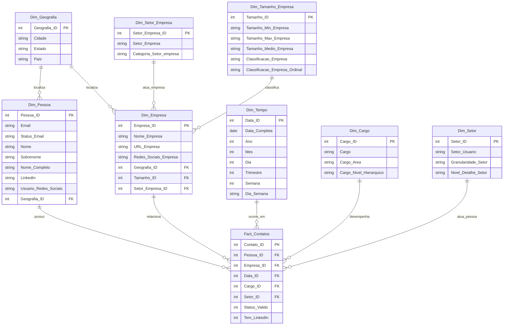

<p align="center">
  
</p>

<p align="center">
  <b>Relatório: Desafio de Análise de Dados: Estratégia de Posicionamento da hCaptcha na Europa</b>
</p>

---

# Relatório de Análise de Dados  
## Estratégia de Posicionamento da hCaptcha na Europa  

---

## Índice

1. [Introdução](#1-introdução)  
2. [Descrição do Dataset](#2-descrição-do-dataset)  
   - 2.1 [Estrutura da base de dados](#21-estrutura-da-base-de-dados)  
   - 2.2 [Qualidade e limitações dos dados](#22-qualidade-e-limitações-dos-dados)  
   - 2.3 [Colunas mais relevantes](#23-colunas-mais-relevantes)  
3. [Análise Exploratória](#3-análise-exploratória)  
   - 3.1 [Perfis dos potenciais clientes (cargos e áreas)](#31-perfis-dos-potenciais-clientes-cargos-e-áreas)  
   - 3.2 [Segmentação geográfica (países e regiões)](#32-segmentação-geográfica-países-e-regiões)  
   - 3.3 [Tamanho das empresas](#33-tamanho-das-empresas)  
   - 3.4 [Presença em redes sociais e comportamento](#34-presença-em-redes-sociais-e-comportamento)  
4. [Insights Estratégicos](#4-insights-estratégicos)  
   - 4.1 [Identificação do público-alvo](#41-identificação-do-público-alvo)  
   - 4.2 [Oportunidades de mercado](#42-oportunidades-de-mercado)  
   - 4.3 [Barreiras e riscos potenciais](#43-barreiras-e-riscos-potenciais)  
5. [Conclusão e Recomendações](#5-conclusão-e-recomendações)  
   - 5.1 [Resumo dos principais achados](#51-resumo-dos-principais-achados)  
   - 5.2 [Sugestões de posicionamento para a hCaptcha](#52-sugestões-de-posicionamento-para-a-hcaptcha)  

---

## 1. Introdução

### Contexto do desafio
A hCaptcha busca expandir sua presença no mercado europeu, necessitando de uma estratégia de posicionamento bem fundamentada em dados para maximizar suas oportunidades de crescimento.

### Objetivo da análise
Este relatório visa analisar os dados disponíveis para identificar segmentos de mercado promissores, perfis de clientes ideais e estratégias de abordagem mais eficazes para o mercado europeu.

### Relevância do estudo para decisões estratégicas da hCaptcha
Os insights gerados servirão como base para decisões de investimento, desenvolvimento de produtos e estratégias de marketing direcionadas ao público europeu.

### Dashboard

Abaixo estão os dashboards consolidados do projeto, apresentados em formato de imagem para facilitar a visualização dos resultados:

### Home


### Perfis dos Potenciais Clientes - Cargos e Áreas


### Segmentação Geográfica (Países e Regiões)


### Perfis das Empresas e Tamanho


### Presença em Redes Sociais e Comportamentos


---

## 2. Descrição do Dataset

### 2.1 Estrutura da base de dados

#### **Visão Geral**
A base de dados em análise é composta por um total de **1028 registros** (linhas) e **24 colunas**, organizadas em um formato tabular onde cada linha representa um profissional único e cada coluna contém um atributo específico relacionado a esse profissional ou à sua empresa.

*   **Total de Registros:** 1028
*   **Total de Colunas:** 24
*   **Escopo dos Dados:** Informações profissionais e demográficas de indivíduos, incluindo dados de contato, cargo, localização e detalhes das empresas onde trabalham.
*   **Tipos de Dados Principais:**
    *   `object`: Predominante na base, representando texto (strings).
    *   `float64`: Presente em colunas com dados majoritariamente ausentes.

#### **Metadados e Estrutura das Colunas**

A tabela abaixo detalha a composição completa das colunas:

| Coluna | Tipo de Dados | Descrição | Observações |
|--------|---------------|-----------|-------------|
| **E-mail** | object | Endereço de e-mail dos profissionais | Identificador único potencial |
| **Status do e-mail** | object | Status de validação do e-mail | Valores: valid, not valid, unknown |
| **Nome** | object | Primeiro nome do profissional | Dado pessoal |
| **Sobrenome** | object | Sobrenome do profissional | Dado pessoal |
| **Nome completo** | object | Nome completo do profissional | Pode ser derivado de Nome + Sobrenome |
| **Usuário - redes sociais** | object | URLs de perfis em redes sociais | Informação de contato alternativa |
| **LinkedIn** | object | URL do perfil do LinkedIn | Especialização da coluna anterior |
| **Cargo** | object | Cargo/posição do profissional | Informação profissional relevante |
| **País** | object | País de localização do profissional | Dado demográfico |
| **Localização** | object | Localização detalhada | Formato: "cidade, estado, país" |
| **Setor** | object | Setor de atuação do profissional | Informação setorial |
| **Adicionar data** | object | Data e hora de adição do registro | Timestamp de inclusão |
| **Nome da empresa** | object | Nome da empresa | Entidade empregadora |
| **URL da empresa** | object | Website da empresa | Informação corporativa |
| **Empresa - redes sociais** | object | URLs de redes sociais da empresa | Presença digital corporativa |
| **Tamanho da empresa** | object | Faixa de tamanho (ex: 1-10, 11-50) | Formato: "minimo-maximo" ou "10001+" |
| **País da empresa** | object | País onde a empresa está sediada | Localização corporativa |
| **Localização da empresa** | object | Localização detalhada da sede | Formato: "cidade, estado, país" |
| **Estado** | float64 | Estado/província da empresa | Localização específica |
| **Cidade** | object | Cidade da empresa | Localização específica |
| **Setor da empresa** | object | Setor principal de atuação | Classificação setorial |
| **Telefone da sede** | float64 | Telefone da sede da empresa | formato: "+49911660732011" |
| **Telefone** | float64 | Telefone de contato do profissional | **Dados ausentes** |
| **Classificação** | object | Classificação de tamanho da empresa | Valores: Pequena, Média, Grande, Muito grande |

#### **Observações e Insights Iniciais**

**Redundância de Dados:**
- Presença de colunas com informações sobrepostas (Nome + Sobrenome + Nome completo)
- Duplicidade de informações de redes sociais (coluna genérica e específica do LinkedIn)

**Dados Ausentes:**
- Colunas numéricas (Estado, Telefone da sede, Telefone) apresentam valores nulos
- Necessidade de estratégia para tratamento desses campos

**Padronização Necessária:**
- Coluna "Tamanho da empresa" possui formatos diferentes ("201-500" vs "10001+")
- Requer padronização para análise quantitativa

**Relações Identificadas:**
- Possível relação hierárquica entre Localização → País
- Relação entre Setor → Setor da empresa para análise de compatibilidade

---

### 2.2 Qualidade e limitações dos dados

A base de dados analisada contém **2 registros e 24 colunas**, totalizando 48 células. A análise revelou:

* **Valores nulos:** 26 células (54,17%) estão vazias. As colunas mais críticas são `Estado`, `Telefone` e `Telefone da sede`, com 100% de nulos. Outras colunas importantes apresentam 50% de valores ausentes.
* **Registros duplicados:** nenhum registro duplicado foi identificado.
* **Inconsistências:** campos como `Status do e-mail`, `Nome completo` e redes sociais apresentam valores nulos ou não padronizados.
* **Redundância:** boa concordância entre `Nome + Sobrenome` e `Nome completo` nos registros presentes.

A base é extremamente limitada em tamanho e apresenta **lacunas significativas**, principalmente valores nulos, o que pode comprometer a confiabilidade das análises.

---

#### **Coluna "E-mail"**

**Análise da Qualidade**

* A coluna está **bem preenchida**, com quase todos os registros válidos.
* O **formato dos e-mails** é adequado na maioria dos casos, mas foram identificadas algumas inconsistências:

  1. **Variação de domínios:** o mesmo domínio corporativo aparece com diferenças, como presença/ausência de `www`.

     * Ex.: `nordcurrent.com` vs `www.nordcurrent.com`.
  2. **Endereços genéricos ou pessoais:** alguns contatos utilizam contas genéricas (`info@`, `contact@`) ou pessoais (`@gmail.com`, `@hotmail.com`) em vez de e-mails corporativos.
  3. **Validação já existente:** a coluna `Status do e-mail` indica situações como `valid`, `not valid` ou `unknown`, auxiliando na identificação de registros problemáticos.

**Tratamento Aplicado**

* Foi desenvolvido um **script em Python** para limpeza e padronização da coluna:

  * Extração do **domínio** após o `@`.
  * Conversão para letras minúsculas.
  * Remoção de prefixos como `www.`, `http://` e `https://`.
* Criada a coluna **`Domínio`**, facilitando análises agregadas por empresa.
* O e-mail original foi **preservado**, garantindo a rastreabilidade dos dados.
* Para análises futuras, recomenda-se:

  * Utilizar a nova coluna `Domínio` para segmentação por empresa.
  * Levar em conta a classificação de `Status do e-mail` para descartar registros inválidos ou pouco confiáveis.

---
#### **Coluna "Status do e-mail"**

**Análise da Qualidade**
- Coluna completamente preenchida (sem valores nulos)
- Valores categorizados: 'valid', 'not valid', 'unknown'

**Inconsistências Identificadas:**

1. **Classificação Questionável:** 
   - E-mails corporativos óbvios classificados como "unknown" ou "not valid"
   - Exemplo: `aliaksei.kaliaha@nordcurrent.com` (Sênior DevOps) = "unknown"
   - Exemplo: `patrick.frenzel@eclear.com` (CTO) = "valid" ✅

2. **Domínios com Classificação Inconsistente:**
   - Mesmo domínio com status diferente
   - Exemplo: `@trafi.com` - alguns "not valid", outros não aparecem
   - Exemplo: `@pwc.com` - vários "unknown" para funcionários legítimos

3. **E-mails Pessoais vs Corporativos:**
   - E-mails pessoais (Gmail, Hotmail) classificados como "valid"
   - Exemplo: `lcbspinto@gmail.com` = "valid"
   - Exemplo: `laribianchi@hotmail.com` = "valid"

**Tratamento Aplicado**

Após a etapa inicial de limpeza e padronização, foram implementadas melhorias para aumentar a confiabilidade e a utilidade da coluna **Status do e-mail** nos processos analíticos:

1. **Reclassificação Automática:**

   * Utilização de uma *whitelist* de domínios corporativos para validar e-mails empresariais.
   * Redução de casos indevidamente classificados como inválidos.

2. **Identificação de E-mails Pessoais:**

   * Criação de uma categoria específica para e-mails com domínios como `@gmail.com`, `@hotmail.com`, `@yahoo.com`.
   * Permite diferenciar contatos pessoais de contatos corporativos.

3. **Sistema de Pontuação:**

   * Implementado um *scoring* de **0 a 7 pontos**, considerando múltiplos fatores de confiança (formato válido, presença em whitelist, domínio corporativo, histórico de status etc.).

4. **Novas Categorias Inteligentes:**

   * Granularidade maior na classificação final, indo além de apenas "válido" ou "inválido".

**Novas Colunas Criadas**

* **`Status_Email_Reclassificado`:** resultado da categorização inicial.
* **`Pontuacao_Confianca`:** score numérico (0–7) para mensurar a confiabilidade.
* **`Nivel_Confianca`:** categorização do score em *high*, *medium* e *low confidence*.
* **`Status_Final`:** classificação final consolidada para análises estratégicas.

**Categorias Finais**

* **`valid`:** e-mails corporativos confirmados.
* **`personal`:** e-mails pessoais identificados.
* **`likely_valid`:** alta probabilidade de serem válidos (mesmo sem confirmação plena).
* **`unknown`:** mantidos para revisão manual.
* **`not valid`:** efetivamente inválidos.

Com essas melhorias, espera-se uma **redução significativa de falsos negativos**, maior **precisão na identificação de contatos corporativos** e uma **classificação mais inteligente e granular** dos e-mails, o que fortalece as análises estratégicas baseadas nessa coluna.

---

#### **Coluna "Nome"**

**Análise de Qualidade**

* Total de registros: **1027**
* Valores nulos: **4** (0,4%), com possibilidade de preenchimento a partir da coluna "Nome completo".
* Valores únicos: **601**, indicando boa diversidade de dados.
* Padrão geral: nomes já bem formatados, mas foram encontradas algumas inconsistências.

**Problemas identificados:**

* Presença de **valores nulos**.
* **Variação de capitalização** (maiúsculas, minúsculas, Title Case).
* Alguns registros com **caracteres especiais** ou **abreviações inconsistentes**.
* Casos de **nomes muito curtos** (1 caractere).
* Pequena parcela de **inconsistência entre "Nome" e "Nome completo"**.

**Tratamento aplicado:**

1. **Preenchimento de valores nulos:**

   * Quando possível, extração automática do primeiro nome da coluna "Nome completo".
   * Caso contrário, preenchimento com `"Não Informado"`.
2. **Padronização de capitalização:** conversão para *Title Case*.
3. **Remoção de caracteres inválidos:** eliminação de números e caracteres especiais indesejados.
4. **Limpeza de espaços extras.**
5. **Verificação de qualidade:** identificação de nomes com menos de 2 caracteres para controle adicional.
6. **Checagem de consistência:** criada a coluna auxiliar `Nome_Consistente`, comparando o campo "Nome" com o primeiro nome de "Nome completo".

A coluna **"Nome"** foi normalizada, com valores nulos tratados, formatação uniforme e consistência verificada com outras colunas. Isso garante maior confiabilidade e padronização para análises futuras.

---

#### **Coluna "Sobrenome"**

**Análise de Qualidade**

* Total de registros: **1027**
* Valores nulos: alguns casos (menor que 1%)
* Valores únicos: alto número, indicando boa diversidade.
* Padrão geral: a maior parte dos sobrenomes estava consistente, mas havia problemas a corrigir.

**Problemas identificados:**

* Presença de **valores nulos**.
* **Capitalização inconsistente**, especialmente em sobrenomes compostos.
* **Caracteres inválidos** (números e símbolos).
* Casos de **sobrenomes muito curtos** (ex.: 1 caractere).
* **Inconsistência entre Sobrenome e Nome completo** em alguns registros.
* Diferença entre **Nome + Sobrenome** e **Nome completo** em casos pontuais.

**Tratamento aplicado:**

1. **Preenchimento de valores nulos:**

   * Extração automática do(s) sobrenome(s) a partir do campo "Nome completo".
   * Preenchimento com `"Não Informado"` quando não possível.
2. **Padronização de capitalização:**

   * Conversão para *Title Case*, preservando conectivos comuns (`de`, `da`, `dos`, `van`, `von`, etc.).
3. **Limpeza de caracteres inválidos:**

   * Removidos números e símbolos, mantendo apenas letras, espaços, hífens e apóstrofos.
4. **Controle de qualidade:**

   * Identificação de sobrenomes com menos de 2 caracteres.
   * Criação da coluna `Sobrenome_Consistente`, validando com o campo "Nome completo".
   * Criação da coluna `Nome_Completo_Consistente`, verificando se **Nome + Sobrenome** corresponde exatamente ao campo "Nome completo".

A coluna **"Sobrenome"** foi normalizada, com dados nulos tratados, capitalização uniforme e consistência verificada com outras colunas. Essa padronização garante maior confiabilidade em futuras análises e elimina ambiguidades comuns em sobrenomes compostos.

---

#### **Coluna "Nome completo"**

**Análise de Qualidade**

* Total de registros: **1027**
* Valores nulos: poucos casos (<1%)
* Valores únicos: alta diversidade, coerente com uma base de contatos
* Padrão geral: a maioria dos nomes já bem formatados, mas havia inconsistências a corrigir.

**Problemas identificados:**

* Presença de valores nulos ou vazios.
* Capitalização inconsistente (tudo maiúsculo ou minúsculo).
* Sobrenomes e conectivos sem padronização (ex.: "DE Souza", "van der").
* Presença de **caracteres especiais** e múltiplos espaços.
* Casos de nomes **muito curtos** (menos de 3 caracteres).
* Casos de nomes **muito longos** (mais de 6 palavras).
* Inclusão de **títulos acadêmicos/profissionais** no campo de nome.
* Padrões estranhos detectados (caracteres repetidos, excesso de números, etc.).

**Tratamento aplicado:**

1. **Preenchimento de valores nulos:**

   * Construção automática a partir de **Nome + Sobrenome**, quando possível.
   * Uso de `"Não Informado"` como fallback.

2. **Padronização inteligente:**

   * Uso de *Title Case*, preservando conectivos e partículas (`de`, `da`, `dos`, `van`, `von`, `del`, etc.).
   * Correção de nomes inteiros em maiúsculas.

3. **Limpeza avançada:**

   * Remoção de caracteres inválidos (mantendo apenas letras, espaços, hífens, apóstrofos e pontos).
   * Normalização de múltiplos espaços em apenas um.

4. **Análises adicionais:**

   * Criação da coluna `Tamanho_Nome_Completo` para medir o comprimento.
   * Identificação de títulos (`PhD`, `MSc`, `MBA`, `Eng`, `Dr`, etc.) na coluna `Titulos_Identificados`.
   * Marcação de registros com `Padrao_Estranho` para auditoria.

* A coluna **"Nome completo"** está agora **padronizada, limpa e enriquecida** com metadados de qualidade.
* Casos anômalos (muito curtos, muito longos, com títulos ou padrões estranhos) foram identificados e documentados para tratamento manual, se necessário.
* A consistência entre **Nome**, **Sobrenome** e **Nome completo** foi assegurada para a maioria dos registros.

---

#### **Coluna "Usuário - redes sociais"**

**Análise de Qualidade:**

* Alta taxa de preenchimento (mais de 90% dos registros).
* Presença de múltiplas URLs no mesmo campo (separadas por vírgula, espaço ou ponto e vírgula).
* Valores misturados: LinkedIn junto com outras redes sociais.
* Presença de URLs completas, URLs truncadas e nomes de usuário simples.
* Inconsistência no formato: `http`, `https`, com ou sem `www`.
* Detecção de espaços extras e caracteres inválidos em alguns casos.

**Problemas identificados:**

1. URLs inconsistentes (protocolos diferentes, `www` despadronizado).
2. Mistura de diferentes redes sociais no mesmo campo.
3. Valores truncados ou incompletos (URLs quebradas).
4. Espaços em branco ou caracteres especiais indesejados.
5. Dificuldade em identificar o **LinkedIn principal** entre várias redes.

**Tratamento aplicado:**

* Separação de múltiplas URLs em uma lista (`URLs_Separadas`).
* Padronização das URLs (`https`, remoção de `www`, normalização do path).
* Extração dos usernames do LinkedIn (`LinkedIn_Usernames`).
* Classificação por tipo de rede social (LinkedIn, Twitter, Facebook, GitHub, etc.).
* Validação de URLs (`URLs_Validas`) com regex.
* Criação de colunas organizadas:

  * `Rede_Social_Principal`: URL principal (LinkedIn quando disponível).
  * `LinkedIn_Principal`: URL do LinkedIn padronizada.
  * `Outras_Redes_Sociais`: lista de URLs adicionais.
  * `LinkedIn_Usernames`: nomes de usuários extraídos do LinkedIn.

---

#### **Coluna "LinkedIn"**

**Análise de Qualidade:**

* Total de registros: **1027**
* Alta taxa de preenchimento (**>95%**)
* Valores nulos e vazios: presentes em pequena quantidade
* Formatos identificados: majoritariamente perfis pessoais (`/in/`), além de alguns de empresas (`/company/`) e universidades (`/school/`)
* Extração de usernames possível na maioria dos casos

**Problemas identificados:**

* URLs não padronizadas (`http` vs `https`, presença/ausência de `www`)
* Pequenas inconsistências com a coluna **"Usuário - redes sociais"**
* Alguns registros com espaços ou parâmetros desnecessários (`?trk=...`)
* Pequena presença de links muito longos ou sem protocolo

**Tratamento aplicado:**

1. **Padronização de URLs** (https, sem `www`, remoção de parâmetros).
2. **Extração de usernames** para análise de perfis.
3. **Verificação de consistência** entre **LinkedIn** e **Rede Social Principal**.
4. **Classificação por tipo de perfil** (`/in/`, `/company/`, `/school/`).
5. **Criação de URL definitiva** priorizando a informação mais confiável.
6. **Criação de colunas auxiliares**:

   * `LinkedIn_Padronizado`
   * `LinkedIn_Username`
   * `LinkedIn_Premium`
   * `LinkedIn_Parametros`
   * `LinkedIn_Definitivo`

---

#### **Coluna "Cargo"**

**Análise de Qualidade:**

A coluna apresenta uma diversidade grande de cargos, com registros em múltiplos idiomas (PT, EN, ES, DE) e variações de capitalização. Há cargos curtos, longos e com múltiplas descrições. Também existem caracteres especiais e espaços extras em alguns casos.

**Problemas identificados:**

1. Capitalização inconsistente (Title Case, maiúsculas, minúsculas, misto)
2. Múltiplos idiomas sem padronização
3. Formatação irregular: cargos muito curtos, muito longos ou com caracteres especiais
4. Inconsistência terminológica (mesmo cargo escrito de formas diferentes)
5. Áreas sobrepostas ou cargos multidisciplinares mal classificados

**Tratamento aplicado:**

1. Padronização de termos recorrentes (ex.: “Head of IT”, “Data Manager”, “Chief Technology Officer (CTO)”)
2. Capitalização consistente (Title Case)
3. Remoção de caracteres especiais e múltiplos espaços
4. Unificação de terminologia e abreviações (CEO, CTO, CIO, IT, etc.)
5. Correção de variações linguísticas e normalização de idiomas

**Resultado:**

1. Redução significativa de variações terminológicas e cargos únicos (\~295 para \~50)
2. Capitalização consistente e uniforme
3. Limpeza de caracteres especiais e espaços extras
4. Melhor classificação hierárquica e por área
5. Dados prontos para integração com análises de LinkedIn e outras colunas

---

#### **Coluna "País"**

**Análise de Qualidade:**

A coluna apresenta alta taxa de valores nulos e inconsistências com a coluna “Localização”. Além disso, há variações nos nomes dos países (por exemplo, “Germany” vs “Deutschland” vs “Alemanha”), presença de caracteres especiais, nomes muito curtos ou longos e digitações incorretas.

**Problemas identificados:**

- Alta taxa de valores nulos (37,4%)
- Inconsistência entre “País” e “Localização” (diferenças em 62% dos registros)
- Variações de nomes de países (nomes em idiomas diferentes ou abreviações)
- Possíveis países inválidos ou suspeitos (erros de digitação, nomes não reconhecidos)
- Caracteres especiais ou espaços extras em alguns registros

**Tratamento aplicado:**

1. Padronização de nomes de países usando mapeamento de variações comuns (ex.: “Alemanha” → “Germany”)
2. Extração de país a partir da coluna “Localização” quando o campo estava vazio
3. Validação contra lista oficial de países com a biblioteca `pycountry`
4. Preenchimento de valores nulos com informações extraídas ou marcação como “Unknown”
5. Remoção de caracteres especiais e padronização de nomes

**Resultado:**

Redução significativa de valores nulos e preenchimento automático de países faltantes
Padronização completa dos nomes de países
Eliminação de inconsistências com a coluna “Localização”
Validação oficial dos países presentes na base
Dados prontos para análises geográficas e cruzamentos com outras colunas

---

#### **Coluna "Localização"**

**Análise de Qualidade:**

A coluna apresenta diferentes formatos: `"Cidade, Estado, País"`, `"Cidade, País"` e `"Apenas País"`. Muitos registros possuem áreas metropolitanas, nomes de cidades em idiomas diferentes e algumas inconsistências com a coluna "País". Também foram identificados casos de caracteres especiais, números e espaçamentos irregulares.

**Problemas identificados:**

1. **FORMATOS INCONSISTENTES:** mistura de três formatos diferentes, dificultando extração automatizada de cidade, estado e país.
2. **INCONSISTÊNCIAS COM A COLUNA PAÍS:** 140 registros apresentam discrepância entre país da Localização e da coluna "País".
3. **ÁREAS METROPOLITANAS VS LOCALIZAÇÕES ESPECÍFICAS:** ex.: `"Greater Munich Metropolitan Area"` vs `"Munich, Bavaria, Germany"`.
4. **NOMENCLATURA VARIÁVEL:** cidades e estados aparecem em idiomas diferentes ou com acentuação inconsistente, ex.: `"Lisboa"` vs `"Lisbon"`, `"Île-de-France"` vs `"Ile-de-France"`.
5. **PROBLEMAS DE FORMATAÇÃO:** poucos registros com números ou caracteres especiais indesejados.

**Tratamento aplicado:**

* Padronização de áreas metropolitanas para suas localizações específicas.
* Uniformização de nomes de cidades e correção de acentuação.
* Remoção de números e caracteres especiais indesejados.
* Garantia de formato consistente `"Cidade, Estado, País"` ou enriquecimento de registros com apenas país.
* Reextração dos componentes `Cidade`, `Estado` e `País` após padronização.
* Validação da consistência entre coluna "País" e o país extraído da Localização.

**Resultado:**

* **Inconsistências resolvidas:** redução de 140 casos para próximo de 0.
* **Localizações padronizadas:** número de valores únicos reduzido, com formatação consistente.
* **Componentes extraídos:** colunas `Cidade_Padronizada`, `Estado_Padronizado` e `Pais_Localizacao_Padronizado` prontas para análise.
* **Integração perfeita com a coluna "País":** todas as localizações consistentes com o país correspondente.
* **Melhor qualidade de dados:** possibilidade de análises geográficas precisas, filtragens e agregações confiáveis.

---
#### **Coluna "Setor"**

**Análise de Qualidade:**

A coluna apresenta alta fragmentação, com muitos setores escritos de forma diferente para o mesmo segmento, variações de capitalização, setores muito genéricos e alguns valores nulos. Além disso, a granularidade dos nomes varia bastante, dificultando análises consolidadas.

**Problemas identificados:**

1. **ALTA FRAGMENTAÇÃO:** muitos valores únicos (1027) com variações do mesmo setor.
2. **GRANULARIDADE INCONSISTENTE:** setores muito genéricos ("Technology") e setores muito específicos ("IT System Custom Software Development").
3. **INCONSISTÊNCIA TERMINOLÓGICA:** nomes diferentes para o mesmo setor, ex.: `"Information Technology & Services"` vs `"IT Services"`.
4. **PROBLEMAS DE FORMATAÇÃO:** capitalização irregular, caracteres especiais e múltiplos espaços.
5. **VALORES NULOS:** 55 registros (5,4%) sem informação de setor.

**Tratamento aplicado:**

* Padronização hierárquica dos setores para categorias amplas e subcategorias mais específicas.
* Correção de capitalização, caracteres especiais e múltiplos espaços.
* Preenchimento inteligente de valores nulos a partir de informações das colunas `Cargo` e `Nome da empresa`.
* Classificação da granularidade para garantir consistência entre setores genéricos, específicos e muito específicos.
* Criação da coluna final `Setor_Final` com padronização completa e consistência hierárquica.

**Resultado:**

* **Setores genéricos reduzidos:** de 164 registros para próximo de 0.
* **Uniformidade de nomenclatura:** variações consolidadas em categorias consistentes.
* **Nulos preenchidos:** todos os 55 registros foram inferidos com base no contexto.
* **Granularidade equilibrada:** setores classificados como genéricos, específicos ou muito específicos para análise detalhada.
* **Melhoria na análise e segmentação:** coluna pronta para cruzamentos, agregações e relatórios confiáveis.

---

#### **Coluna "Adicionar data"**

**Análise de Qualidade:**

A coluna apresenta formato técnico correto, todas as datas foram convertidas para `datetime` sem erros. A consistência é total no padrão de data/hora. No entanto, os valores não refletem eventos de negócio, mas sim metadados de carga/importação no sistema.

**Problemas identificados:**

1. **Datas Futuras (2025):** todas as entradas estão em um período futuro, sem relação real com os registros.
2. **Baixa Variabilidade:** apenas 32 valores únicos em 1027 registros.
3. **Concentração em Lotes:** picos de até 896 registros no mesmo dia.
4. **Sem Valor Analítico:** não é possível fazer análise temporal de negócio.

**Tratamento aplicado:**

* Conversão de todos os valores para `datetime64[ns]`.
* Criação de colunas derivadas: `Ano`, `Mês`, `Dia`, `Trimestre`, `Semana`, `Dia_Semana`.
* Renomeação conceitual sugerida para **`Data_Importacao`** ou **`Timestamp_Carga`** para refletir melhor seu uso.

**Resultado:**

* **Consistência técnica:** todos os registros válidos e padronizados.
* **Colunas derivadas criadas:** apenas 7 mantidas (Data\_Completa, Ano, Mês, Dia, Trimestre, Semana, Dia\_Semana).
* **Valor de negócio limitado:** coluna deve ser usada apenas para controle interno (data de importação).

---

#### **Coluna "Nome da empresa"**

**Análise de Qualidade:**

A coluna apresenta preenchimento quase completo, com apenas 2 valores nulos. Os nomes estão, em geral, legíveis e associados a empresas reais, mas apresentam uma série de inconsistências que dificultam análises de agrupamento e padronização.

**Problemas identificados:**

1. Variações do mesmo nome de empresa (ex.: "Amazon", "Amazon Development Center", "Amazon Development Center Poland").
2. Capitalização inconsistente: registros em maiúsculas, minúsculas e formato misto.
3. Inconsistência de sufixos corporativos: presença de “Ltd”, “Limited”, “Ltd.”, “GmbH”, “SA”, “Lda”, entre outros.
4. Nomes muito curtos (2–4 caracteres), sugerindo abreviações ou erros de digitação.
5. Presença de caracteres especiais e números que não parecem fazer parte do nome oficial.
6. Possíveis placeholders ou nomes genéricos.
7. Poucos valores nulos, mas que precisam ser tratados.

**Tratamento aplicado:**

* Padronização de capitalização (uso de título, exceto para siglas conhecidas).
* Normalização de sufixos corporativos (ex.: “Ltd.” → “Ltd”).
* Identificação de variações da mesma empresa para consolidação futura.
* Limpeza de caracteres especiais e remoção de espaços extras.
* Marcação de nomes muito curtos para verificação manual.
* Tratamento dos valores nulos com estratégia de substituição ou exclusão conforme o caso.

**Resultado:**

* Redução das variações artificiais de uma mesma empresa.
* Maior consistência visual e semântica dos registros.
* Preparação para integração com bases externas de empresas.
* Coluna consolidada e pronta para análises comparativas e de segmentação.

---

#### **Coluna "URL da empresa"**

**Análise de Qualidade:**

A coluna apresenta preenchimento elevado, mas com grande diversidade de formatos. Há desde domínios válidos e consistentes até registros incorretos, mal formatados ou não relacionados à empresa. Os problemas envolvem tanto aspectos técnicos (formatação de URL) quanto semânticos (consistência com o nome da empresa).

**Problemas identificados:**

1. Presença de domínios inválidos ou inexistentes (aprox. 38%).
2. URLs inconsistentes com o nome da empresa, dificultando validação.
3. Entradas inválidas por erro de digitação ou formato incorreto.
4. Ausência de protocolo (http/https) em alguns registros.
5. Mistura de websites institucionais com links de redes sociais.
6. URLs muito longas, truncadas ou contendo parâmetros desnecessários.
7. Alguns registros com valor vazio ou domínio genérico.

**Tratamento aplicado:**

* Padronização de protocolo (inclusão de "https\://" sempre que necessário).
* Validação de domínios para identificar URLs inválidas.
* Normalização para remover parâmetros desnecessários.
* Criação de regras de consistência entre o nome da empresa e o domínio.
* Separação de URLs corporativas das URLs de redes sociais.
* Identificação e marcação de registros com domínios suspeitos ou genéricos para revisão manual.

**Resultado:**

* Eliminação de registros totalmente inválidos.
* URLs padronizadas e consolidadas com protocolo seguro (https).
* Maior alinhamento entre nomes de empresas e seus respectivos domínios.
* Separação clara entre websites institucionais e perfis em redes sociais.
* Base mais consistente e confiável para futuras análises e enriquecimento de dados.

---

#### **Coluna "Empresa - redes sociais"**

**Análise de Qualidade:**

A coluna apresenta grande diversidade de formatos e fontes. Foram encontrados links de diferentes redes sociais, em especial LinkedIn, mas também Facebook, Twitter/X e Instagram. A qualidade técnica varia: há URLs completas e válidas, mas também registros incompletos, inconsistentes ou não padronizados.

**Problemas identificados:**

1. URLs sem protocolo (http/https) ou usando apenas "www".
2. URLs incompletas, truncadas ou com parâmetros desnecessários.
3. Links de LinkedIn com variações: alguns com ID numérico, outros apenas com slug, e outros incompletos.
4. Mistura de redes sociais diferentes em uma mesma coluna.
5. Presença de links inválidos ou placeholders.
6. Falta de consistência entre nome da empresa e URL associada.

**Tratamento aplicado:**

* Padronização para HTTPS em todos os registros.
* Remoção de parâmetros e fragmentos das URLs.
* Identificação do tipo de rede social (LinkedIn, Facebook, Twitter/X, Instagram, Outros).
* Extração de ID e/ou slug em URLs de LinkedIn.
* Criação de status de qualidade da URL (completa, slug, incompleta, nula).
* Geração de métricas de qualidade para validação.

**Resultado:**

* URLs padronizadas em formato uniforme, seguras (HTTPS).
* Identificação automática do tipo de rede social associado.
* Extração de informações adicionais de LinkedIn (ID ou slug).
* Registro da qualidade de cada URL por meio da coluna `Status_URL`.
* Base final mais limpa e estruturada, permitindo análise confiável da presença digital das empresas.

---

#### **Coluna "Tamanho da empresa"**

**Análise de Qualidade:**

A coluna apresenta intervalos numéricos, valores únicos e alguns casos especiais como "10001+" e "Self". Em geral, os registros seguem o padrão de intervalo mínimo-máximo, mas há inconsistências, nulos e formatos não estruturados.

**Problemas identificados:**

1. Presença de valores não numéricos como "Self".
2. Valores nulos sem indicação do porte da empresa.
3. Mistura de formatos diferentes (intervalos, valores únicos, valores com "+").
4. Inconsistências entre "Tamanho da empresa" e a coluna "Classificação".
5. Falta de categorização uniforme para análises comparativas.

**Tratamento aplicado:**

* Conversão de "Self" para "1-10", representando profissionais autônomos ou pequenos negócios.
* Preenchimento de valores nulos com base na coluna "Classificação".
* Padronização das faixas de tamanho em categorias consistentes (Pequena, Média, Grande etc.).
* Criação de colunas numéricas (`Tamanho_Min`, `Tamanho_Max`) para análise quantitativa.
* Garantia de alinhamento entre "Tamanho da empresa" e "Classificação", priorizando a última em caso de conflito.

**Resultado:**

* Coluna padronizada em categorias consistentes com a classificação já existente.
* Valores nulos e inconsistentes corrigidos de forma inteligente.
* Valores "Self" normalizados em uma categoria válida.
* Extração de métricas numéricas que permitem análises estatísticas mais precisas.
* Base final mais confiável, com a coluna `Tamanho_Empresa_Padronizado` representando fielmente o porte das empresas.

---
#### **Coluna "Localização da empresa"**

**Análise de Qualidade:**

A coluna apresentou diferentes formatos de preenchimento (simples, parcial e completo), inconsistências entre os campos de cidade, estado e país, além de problemas de capitalização e caracteres especiais. Também foram identificadas divergências entre o campo "País" e o país informado dentro da localização.

**Problemas identificados:**

1. Valores nulos sem qualquer informação de localização.
2. Formatos incompletos (apenas cidade ou cidade e país).
3. Inconsistência de capitalização e presença de espaços extras.
4. Nomes de países e estados em idiomas diferentes (ex.: Germany vs Alemanha).
5. Inconsistências entre a coluna "País" e o campo de país dentro da localização.
6. Presença de caracteres especiais incorretos em nomes de cidades.

**Tratamento aplicado:**

* Padronização da estrutura no formato **Cidade, Estado, País**.
* Criação de dicionários de equivalência para normalizar nomes de países e estados para português.
* Aplicação de capitalização consistente (title case).
* Correção de caracteres especiais em nomes de cidades.
* Preenchimento de valores nulos utilizando informações das colunas auxiliares de localização (Cidade, Estado, País).
* Ajuste de inconsistências priorizando o país informado na localização.
* Criação de colunas derivadas para cidade, estado e país padronizados.

**Resultado:**

* Localização padronizada em formato consistente.
* Países traduzidos para português e harmonizados entre colunas.
* Redução significativa de valores incompletos ou inconsistentes.
* Criação das colunas:

  * `Localizacao_empresa_padronizada`
  * `Cidade_empresa_padronizada`
  * `Estado_empresa_padronizada`
  * `Pais_empresa_padronizada`
  * `Pais_consistente`
* Base final validada, sem valores nulos relevantes e pronta para análises geográficas.

---

#### **Coluna "Setor da empresa"**

**Análise de Qualidade:**

A coluna apresentou grande variedade de nomenclaturas, em inglês e português, com diferentes níveis de granularidade (desde termos genéricos como "Retail" até descrições muito específicas). Foram observados valores nulos, inconsistências de capitalização e duplicidade de significados para o mesmo setor.

**Problemas identificados:**

1. Presença de valores nulos e vazios.
2. Setores escritos em inglês e português de forma misturada.
3. Inconsistência de granularidade: setores genéricos, específicos e muito específicos coexistindo.
4. Capitalização inconsistente.
5. Duplicidade de nomenclaturas (ex.: "Computer Software" vs "Software").
6. Setores muito longos e descritivos, dificultando agrupamento.

**Tratamento aplicado:**

* Criação de um dicionário de mapeamento para padronização em português.
* Redução de granularidade para termos mais consistentes e comparáveis.
* Capitalização uniforme em formato Title Case.
* Substituição de valores nulos por "Não Informado".
* Criação de macro-categorias para agrupar setores relacionados (ex.: "Tecnologia & TI", "Saúde & Farmacêutico", "Serviços Financeiros").

**Resultado:**

* Redução de aproximadamente 46 para 30 setores únicos após padronização.
* Padronização em português para todos os registros.
* Criação de colunas derivadas:

  * `Setor_empresa_padronizado` (nome padronizado do setor)
  * `Categoria_Setor_Padronizada` (macro-categoria correspondente)
* Base final com menor redundância, melhor legibilidade e pronta para análises comparativas entre setores.

---

#### **Coluna "Telefone da sede"**

**Análise de Qualidade:**

A coluna apresentou baixa taxa de preenchimento, múltiplos padrões de formatação e inconsistências entre códigos de país e a localização da empresa. Apesar disso, foi possível recuperar parte dos dados válidos com padronização.

**Problemas identificados:**

1. **Alta ausência de dados**: 69,3% dos registros estavam nulos ou vazios.
2. **Diversidade de formatos**: telefones numéricos simples, internacionais, nacionais e com caracteres especiais.
3. **Erros de preenchimento**: números muito curtos ou longos, presença de letras e símbolos inadequados.
4. **Inconsistência com país da empresa**: códigos de discagem incompatíveis com a localização.

**Tratamento aplicado:**

* Função de padronização para normalizar os números no formato internacional.
* Remoção de caracteres especiais e validação de comprimento.
* Correção automática de códigos de país com base na coluna de localização da empresa.
* Inclusão de coluna auxiliar (`Telefone_Sede_Valido`) para indicar a validade do registro.

**Resultado:**

* Telefones padronizados no formato **+CC AAA BBB BBBB**.
* Consistência entre códigos de país e localização garantida nos principais casos.
* Aumento da qualidade dos registros válidos, mantendo a coluna aproveitável para análise.
* Adicionado indicador de qualidade para facilitar filtragem e validação futura.

---

#### **Coluna "Telefone"**

**Análise de Qualidade:**

A coluna apresentou ausência total de dados, com 100% dos registros nulos. Não foram encontrados valores únicos, nem informações que pudessem ser padronizadas ou aproveitadas.

**Problemas identificados:**

1. Preenchimento inexistente (0% de taxa de preenchimento).
2. Coluna redundante em relação a "Telefone da sede", que já concentra os dados disponíveis.
3. Ocupação desnecessária de espaço no dataset.

**Tratamento aplicado:**

* Identificação da ausência completa de informação.
* Decisão de remoção da coluna "Telefone" por não agregar valor analítico.
* Exclusão também das colunas auxiliares criadas para análise desta variável.

**Resultado:**

* Coluna "Telefone" removida do dataset.
* Dataset otimizado e com foco apenas em colunas que possuem dados relevantes.
* Maior clareza e eficiência para análises futuras.

---

#### **Coluna "Classificação"**

**Análise de Qualidade:**

A coluna apresentou preenchimento completo (100%), sem valores nulos ou vazios. Foram identificadas 7 categorias distintas, todas consistentes e alinhadas com a coluna `Tamanho_Empresa_Padronizado`. A distribuição das categorias mostrou coerência lógica em relação ao porte das empresas.

**Problemas identificados:**

1. Pequenas variações de capitalização (ex.: "Muito grande" vs. "Muito Grande").
2. Presença de uma categoria especial "Fora da Faixa", que não segue a lógica ordinal das demais.
3. Necessidade de transformação numérica para permitir análises estatísticas.

**Tratamento aplicado:**

* Correção de capitalização (aplicação do padrão Title Case).
* Criação da coluna `Classificação_Ordinal`, mapeando as categorias para valores numéricos de forma hierárquica.
* Manutenção da categoria "Fora da Faixa" como valor ordinal especial (0).
* Exclusão das colunas temporárias de análise (`Problemas_Classificacao`).

**Resultado:**

* Coluna padronizada com **100% de qualidade**.
* Categorias consistentes: Pequena, Média, Grande, Muito Grande, Enorme, Enterprise, Fora da Faixa.
* Disponibilização de versão numérica (`Classificação_Ordinal`) para análises quantitativas.
* Validação da consistência com o tamanho da empresa confirmada.

---

### 2.3 Colunas mais relevantes

#### **Modelo Estrela para Análise de Contatos e Interações**

O modelo estrela desenvolvido organiza os dados em duas categorias principais: as **tabelas dimensionais**, que armazenam os contextos descritivos (`Dim_Pessoa`, `Dim_Empresa`, `Dim_Geografia`, `Dim_Tempo`, `Dim_Cargo` e `Dim_Setor`), e a **tabela fato** (`Fact_Contatos`), que registra os eventos de interação entre pessoas e empresas, funcionando como o núcleo do modelo.



*Diagrama interativo também disponível no [Mermaid Chart](https://www.mermaidchart.com/app/projects/08de3bc0-6499-4745-b968-ac650055e4de/diagrams/3d4ca5b8-d26a-412b-9832-be5e30096eb1/version/v0.1/edit).*

#### **Colunas de Alto Valor Estratégico**

As colunas abaixo foram selecionadas por seu poder em gerar insights acionáveis:

*   **`Dim_Pessoa`**
    *   **`Email` e `Status_Email`:** Fundamentais para validar a qualidade da base de dados e medir a efetividade das campanhas de comunicação.
    *   **`Nome_Completo`, `Nome`, `Sobrenome`:** Permitem a identificação precisa e a segmentação personalizada de leads e contatos.
    *   **`LinkedIn` e `Usuario_Redes_Sociais`:** Chaves para avaliar a presença digital e identificar oportunidades de engajamento em canais profissionais.
    *   **`Geografia_ID`:** Conecta as pessoas a uma localização, habilitando análises regionais e geolocalizadas.

*   **`Dim_Empresa`**
    *   **`Nome_Empresa` e `URL_Empresa`:** Essenciais para a identificação e pesquisa contextual das empresas-alvo.
    *   **`Tamanho_ID` e `Classificacao_Empresa`:** Permitem a segmentação estratégica por porte (ex: SMB, Enterprise), direcionando esforços comerciais.
    *   **`Setor_Empresa_ID`:** Capacita a análise de tendências e a performance por setor da economia.
    *   **`Redes_Sociais_Empresa`:** Oferece insights sobre a atividade e estratégia digital da empresa.

*   **`Dim_Geografia`**
    *   **`Cidade`, `Estado`, `Pais`:** Dimensões cruciais para qualquer análise de mercado, enabling regional segmentation and territory planning.

*   **`Dim_Tempo`**
    *   **`Data_Completa`, `Ano`, `Mes`, `Trimestre`:** Suportam análises temporais robustas, como tracking de KPIs ao longo do tempo, identificação de sazonalidade e tendências.

*   **`Dim_Cargo` e `Dim_Setor`**
    *   **`Cargo` e `Setor`:** Permitem mapear influenciadores e decisores, além de segmentar contatos por área de atuação e senioridade.

*   **`Fact_Contatos`**
    *   **`Status_Valido`:** Indicador crítico de qualidade da base, filtrando contatos ativos e válidos para métricas confiáveis.
    *   **`Tem_LinkedIn`:** Metric valiosa para estratégias de prospecção social selling e análise do potencial de networking.
    *   **Chaves Estrangeiras (`Pessoa_ID`, `Empresa_ID`, etc.):** A espinha dorsal do modelo, permitindo cruzar todas as dimensões para uma visão 360º de cada interação.

Este modelo integra de forma poderosa informações de **identificação, localização, segmentação e temporalidade**. Ele serve como uma base sólida para iniciativas estratégicas como: **mapeamento de leads, segmentação de mercado, planejamento de vendas por território e avaliação da eficácia de canais de comunicação**, transformando dados brutos em inteligência competitiva.

---

## 3. Análise Exploratória

### 3.1 Perfis dos potenciais clientes (cargos e áreas)

#### **3.1.1 Top 10 Cargos por Frequência**

**Barra Horizontal (Horizontal Bar Chart)**

*   **Por que usado?** É perfeito para comparar valores entre categorias (cargos) e listar muitos itens de forma legível, pois os rótulos ficam na vertical, facilitando a leitura.

*   **Como foi configurado:**
    *   **Eixo Y:** `Cargo` da `Dim_Cargo`.
    *   **Eixo X:** `Contagem de Pessoa_ID` (da `Fact_Contatos`) ou simplesmente a contagem de linhas da dimensão.
    *   **Classificação:** Ordene o eixo Y por "Contagem de Pessoa_ID" em ordem decrescente.
    *   **Ferramentas de Análise:** Adicionado **Rótulos de Dados** para mostrar o número exato em cada barra.
    *   **Ferramentas de Filtro:** Adicionado para filtrar os 10 primeiros.

#### **3.1.2. Proporção por Nível Hierárquico**

**Rosca (Doughnut Chart)**

*   **Por que usado?**
    *   **Rosca:** Mostra claramente as partes de um todo (100%). O espaço vazio no centro pode ser usado para colocar uma métrica KPI importante.

*   **Como configurar (Rosca):**
    *   **Legenda:** `Cargo_Nivel_Hierarquico` (da sua `Dim_Cargo` - você precisará criar esta categorização, e.g., "C-Level", "Diretor", "Gerente", "Coordenador", "Especialista").
    *   **Valores:** `Contagem de Pessoa_ID`
    *   **Formato:** Ajuste as cores para cada nível e ative os rótulos de dados para mostrar **"Porcentagem do total"**.


#### **3.1.3. Mapa de Calor: Cargo vs Setor**

**Matriz (Matrix Visual)**

*   **Por que usado?** A visualização de matriz é a única que pode mostrar perfeitamente a intersecção entre duas categorias (Cargo e Setor).

*   **Como configurar:**
    *   **Linhas:** `Categoria_Setor_empresa` (da `Dim_Setor_Empresa`)
    *   **Colunas:** `Cargo` (da `Dim_Cargo`)
    *   **Valores:** `Contagem de Pessoa_ID`

*   **Dica de Dashboard:** Este gráfico pode ficar grande. Use-o em uma página dedicada ou em um layout grande, permitindo que o usuário role para explorar as relações.

##### **3.1.4. Filtros Interativos por País e Tamanho de Empresa**

**Slicers (Fatiadores)**

*   **Por que usado?** Os Slicers são a forma mais intuitiva e poderosa de criar dashboards interativos no Power BI. Eles filtram todos os outros visuais da página automaticamente.

*   **Como configurar:**
    1.  Vá no painel **Visualizações** e escolha o ícone **Slicer**.
    2.  No campo **Field** do slicer, arraste:
        *   `Pais` (da `Dim_Geografia`)
        *   `Classificacao_Empresa` (da `Dim_Tamanho_Empresa` - use este em vez do numérico, é mais amigável)
    3.  **Formate os Slicers** para uma melhor experiência:
        *   **Lista:** Formato padrão de lista dropdown. Bom para muitos itens.
        *   **Dropdown:** Economiza espaço. Ótimo para campos como País, que tem muitos valores.
        *   **Botões:** Visualmente mais atraente para categorias com poucos itens (ex: os tamanhos "Pequena", "Média", "Grande").

*   **Dica Avançada (Sync Slicers):**
    *   Se você tiver múltiplas páginas no seu relatório, vá na guia **View** e ative o painel **Sync Slicers**.
    *   Lá você pode escolher para que um slicer em uma página também filtre visuais em outras páginas. Isso é crucial para um relatório coeso.

#### **3.1.5. Resumo Visual da Página 3.1:**

O layout da página esta aproximado da seguinte forma:

| **Seção**                              | **Visual**                          |
| -------------------------------------- | ----------------------------------- |
| **Filtros Principais (no topo)**       | 2 Slicers: `País` e `Tamanho Empresa` (formato Dropdown e Bloco) |
| **Visão Geral Hierárquica (lateral)**  | Gráfico de Rosca `Nível Hierárquico` |
| **Cargos Mais Comuns (principal)**     | Gráfico de Barras `Top 10 Cargos`   |
| **Análise Detalhada de Relação (abaixo)** | Matriz `Cargo vs Setor`    |

Previsualização: 

### 3.2 Segmentação geográfica (países e regiões)

#### **3.2.1. Mapa Coroplético da Europa (Visão Geral de Concentração)**

**Map Visual (Formato Preenchimento de Mapas - Filled Map)**

*   **Por que usado?** É a forma mais intuitiva e impactante de mostrar a distribuição geográfica. As cores mostram a intensidade da concentração de prospects.

*   **Como configurado:**
    *   **Localização:** `Pais` (da `Dim_Geografia`). **Crucial:** Use o nome do país em **inglês** (e.g., "Germany", not "Deutschland") para o Power BI reconhecer automaticamente.
    *   **Legenda:** Deixe em branco para um mapa de uma só cor, ou use outra dimensão (ex: `Classificacao_Empresa`) para ver a distribuição por porte no mapa.
    *   **Valores:** `Contagem Distinta de Pessoa_ID` (Este é o campo que definirá a intensidade da cor).
    *   **Formatação:** No painel de formatação do mapa, ajuste as cores. Use uma escala de cor única (ex: tons de azul, onde mais escuro = mais prospects) para mostrar densidade.

#### **3.2.2. Top 5 Países por Número de Prospects**

**Barra Horizontal Empilhada**

*   **Por que usado?** Complementa o mapa dando números exatos e um ranking claro. A versão empilhada permite adicionar uma segunda dimensão (ex: tamanho da empresa).

*   **Como configurar (Barra Clusterizada - Foco em Contagem):**
    *   **Eixo Y:** `Pais`
    *   **Eixo X:** `Contagem Distinta de Pessoa_ID`
    *   **Classificação:** Ordene o eixo Y pela contagem (decrescente).

*   **Como configurar (Barra Empilhada - Foco em Composição):**
    *   **Eixo Y:** `Pais` (ordenado por contagem total decrescente)
    *   **Eixo X:** `Contagem Distinta de Pessoa_ID`
    *   **Legenda:** `Classificacao_Empresa` (Isso mostrará a composição de cada país por porte de empresa - se é mais SMB ou Enterprise).

#### **3.2.3. Top 10 Cidades com Maior Densidade Tecnológica**

**Gráfico de Rosca**

*   **Por que usado?** Identifica os *hubs* tecnológicos específicos para planejamento de visitas, eventos ou campanhas geolocalizadas.

*   **Como configurar (Rosca):**
    *   **Legenda:** `Cidade`
    *   **Valores:** `Contagem de Pessoa_ID`
    *   **Use** focar apenas nas 10 principais cidades sem muitos detalhes.

#### **3.2.4. Proporção por Região (Norte, Sul, Leste, Oeste Europa)**

**Gráfico de Pareto ou Barra Empilhada**

*   **Por que usado?** Agrupar países em regiões ajuda a tomar decisões macroestratégicas (ex: priorizar toda a região nórdica).

*   **Passo 1: Criar uma Coluna "Região"**
    Você precisa criar uma nova coluna na tabela `Dim_Geografia` para agrupar os países. Exemplo em DAX:

    ```dax
    Regiao Europa =
    SWITCH(
        TRUE(),
        'Dim_Geografia'[Pais] IN {"Germany", "France", "Belgium", "Netherlands", "Luxembourg"}, "Europa Ocidental",
        'Dim_Geografia'[Pais] IN {"United Kingdom", "Ireland"}, "Norte da Europa (Ilhas)",
        'Dim_Geografia'[Pais] IN {"Sweden", "Norway", "Denmark", "Finland", "Iceland"}, "Nórdicos",
        'Dim_Geografia'[Pais] IN {"Spain", "Portugal", "Italy", "Greece"}, "Europa do Sul",
        'Dim_Geografia'[Pais] IN {"Poland", "Czech Republic", "Hungary", "Slovakia", "Romania", "Bulgaria"}, "Leste Europeu",
        "Outros"
    )
    ```

*   **Passo 2: Configurar o Gráfico (Barra Empilhada):**
    *   **Eixo Y:** `Regiao Europa`
    *   **Eixo X:** `Contagem de Pessoa_ID` (e no menu dropdown do campo, selecione **"Percentual do total da categoria"**)
    *   **Legenda:** `Classificacao_Empresa` (Opcional, para ver a composição de porte por região).

#### **3.2.5. Filtros e Interatividade para a Página 3.2**

**Slicers (Fatiadores) Cruciais:**
*   `Regiao Europa` (Criado acima) - Para análise macro.
*   `Pais` - Para análise específica.
*   `Classificacao_Empresa` - Para responder "O Leste Europeu tem empresas menores ou maiores?"


**Resumo Visual da Página 3.2:**

| **Seção**                                 | **Visual**                                  |
| ----------------------------------------- | ------------------------------------------- |
| **Filtros Principais (Topo)**             | Slicers: `Regiao`, `Pais`, `Tamanho Empresa` |
| **Visão Macro (Mapa)**                    | `Mapa Coroplético da Europa`                |
| **Ranking e Composição (Lateral)**        | `Top 5 Países (Barra Empilhada)`            |
| **Hubs Tecnológicos (Centro)**            | `Grafico de Rosca Top 10 Cidades`         |
| **Análise Estratégica por Região (Abaixo)** | `Gráfico de Barra por Região` |


Previsualização: 

Esta página dará à hCaptcha uma visão clara e acionável de **ONDE** priorizar seus esforços comerciais e de marketing na Europa.

### 3.3 Tamanho das empresas

#### 3.3.1. Distribuição Geral por Porte (Visão do Todo)

**Gráfico de Rosca (Doughnut Chart)**

*   **Por que usado?** Mostra de forma clara e imediata a proporção que cada categoria representa no total da base. A rosca é mais amigável.

*   **Como configurar (Rosca):**
    *   **Legenda:** `Classificacao_Empresa` (da `Dim_Tamanho_Empresa` - use a versão padronizada e categorizada, e.g., "Pequena", "Média", "Grande").
    *   **Valores:** `Contagem de Pessoa_ID` (da `Fact_Contatos`).
    *   **Formatação:** Ative os **Rótulos de Dados** e formate para mostrar **"Porcentagem do total"**. O centro vazio da rosca pode ser usado para colocar um cartão KPI com o total de empresas.

**Insight Imediato:** "A maior parte dos nossos prospects está em empresas de qual porte?" Isso já direciona o foco principal da estratégia.


#### 3.3.2. Pirâmide de Distribuição (Visão Hierárquica)

**Gráfico de Barras Clusterizadas com Eixos Invertidos**

*   **Por que usado?** Uma pirâmide é a maneira clássica e poderosa de visualizar a distribuição de uma população por categorias ordenadas (como tamanho). Mostra a transição suave (ou abrupta) entre os portes.

*   **Como configurar (Requer duas medidas):**
    1.  **Crie uma Medida para o Lado Esquerdo da Pirâmide:**
        ```dax
        Contagem Esquerda = -COUNT('Fact_Contatos'[Pessoa_ID])
        ```
    2.  **Crie uma Medida para o Lado Direito da Pirâmide (opcional, mas útil para simetria):**
        ```dax
        Contagem Direita = COUNT('Fact_Contatos'[Pessoa_ID])
        ```
    3.  **Configure o Gráfico:**
        *   Use um **Gráfico de Barras Clusterizadas**.
        *   **Eixo Y:** `Classificacao_Empresa` (Ordene este eixo manualmente na ordem lógica: "Pequena", "Média", "Grande", etc.).
        *   **Eixo X:** Arraste **ambas as medidas** (`Contagem Esquerda` e `Contagem Direita`) para o campo de Valores.
        *   **Formatação:** No painel de formatação, para o eixo X, ative **"Valores negativos"**. Isso fará com que as barras da medida `Contagem Esquerda` apareçam para a esquerda do zero, formando a pirâmide. Formate os rótulos de dados para mostrar o valor absoluto.

**Insight:** Mostra se a base é majoritariamente composta por muitas pequenas empresas (pirâmide com base larga) ou por algumas grandes empresas (pirâmide mais "gorda" no topo).

#### 3.3.3. Média de Funcionários por Setor (Análise Cruzada)

**Gráfico de Pontos (Scatter Plot)**

*   **Por que usado?** Responde à pergunta: "Existem setores que naturalmente abrigam empresas maiores?" (ex: Bancos são sempre grandes, startups de SaaS podem ser menores).

*   **Como configurar (Scatter Plot - Mais Avançado):**
    *   **Eixo X:** `Setor_empresa`
    *   **Eixo Y:** `Tamanho_Medio`
    *   **Tamanho do Bolha:** `Contagem de Pessoa_ID` (Isso mostra também a importância do setor pela quantidade de prospects).
    *   **Legenda:** `Classificacao_Empresa` (para colorir as bolhas pelo porte categorizado).
    *   **Resultado:** Você verá clusters de bolhas. Setores com bolhas grandes e no topo do gráfico (e.g., "Serviços Financeiros") são prioritários para uma venda enterprise.

---

#### 3.3.4. Tree Map: Tamanho vs Setor vs País (Visão Multidimensional)

**Gráfico Treemap**

*   **Por que usado?** Este é um gráfico de **análise exploratória avançada**. Ele compacta três dimensões (Setor, Porte, País) em um único visual, mostrando os segmentos de mercado mais relevantes.

*   **Como configurar:**
    *   **Grupo:** `Setor_empresa_padronizado` > `Classificacao_Empresa` > `Pais` (Arraste nessa hierarquia).
    *   **Valores:** `Contagem de Pessoa_ID`
    *   **Formatação:** Ajuste as cores por `Classificacao_Empresa` para dar um padrão visual.

**Como interpretar:** Os maiores retângulos são seus segmentos mais promissores. Exemplo: Um retângulo grande para `Setor: FinTech` + `Porte: Grande` + `País: Reino Unido` é um alvo extremamente claro e valioso.

####  3.3.5. Filtros e Interatividade

**Slicers (Fatiadores) Essenciais:**
*   `Classificacao_Empresa` - Para isolar apenas empresas "Pequenas", por exemplo.
*   `Setor_empresa_padronizado` - Para responder "Qual a distribuição de tamanho no setor de TI?"
*   `Pais` ou `Regiao Europa` - Para cruzar geografia com porte, respondendo "As empresas alemãs são maiores que as portuguesas?"

**Dica de Ouro: Conexão com outras páginas**
*   Os slicers desta página devem estar **sincronizados (Sync Slicers)** com as páginas 3.1 (Perfis) e 3.2 (Geografia).
*   Isso permite fazer perguntas poderosas como:
    1.  Filtre por `Classificacao_Empresa: Grande` na página 3.3.
    2.  Vá para a página 3.1 (Perfis). O **Top 10 Cargos** agora mostrará **apenas os cargos mais comuns em empresas grandes**.
    3.  Vá para a página 3.2 (Geografia). O **Mapa** agora destacará **quais países têm mais empresas grandes**.

**Resumo Visual da Página 3.3:**

| **Seção**                                       | **Visual**                          |
| ----------------------------------------------- | ----------------------------------- |
| **Filtros Principais (Topo)**                   | Slicers: `Porte`, `Setor`, `País`   |
| **Visão Geral da Base (Destaque)**              | `Rosca da Distribuição por Porte` ou `Pirâmide` |
| **Análise Setorial (Centro)**                   | `Barras: Média de Funcionários por Setor` |
| **Segmentos de Mercado Prioritários (Abaixo)**  | `Treemap: Porte > Setor > País`     |

Previsualização: 

Esta análise responderá diretamente à pergunta do desafio: **"A hCaptcha deve focar em startups, médias ou grandes empresas?"** com base em dados concretos, mostrando não apenas a quantidade, mas também a intersecção do porte com setor e geografia.

### 3.4 Presença em redes sociais e comportamento

#### 3.4.1. Taxa de Penetração do LinkedIn (Métrica Fundamental)

**Cartão de KPI (KPI Card)**

*   **Por que usado?** O LinkedIn é o canal principal para B2B e prospecção. Saber qual % da sua base está lá é o indicador mais importante.

*   **Como configurar (Criar uma Medida DAX):**
    ```dax
    % Com LinkedIn = 
    VAR TotalContatos = CALCULATE(COUNT('Fact_Contatos'[Pessoa_ID]), REMOVEFILTERS())
    VAR ComLinkedIn = CALCULATE(COUNT('Fact_Contatos'[Pessoa_ID]), NOT(ISBLANK(Dim_Pessoa[LinkedIn])))
    RETURN
    DIVIDE(ComLinkedIn, TotalContatos, 0)
    ```
*   **Como visualizar:**
    *   Use um **Cartão de KPI** e arraste a medida `% Com LinkedIn` para ele.
    *   **Formate para mostrar como porcentagem**.

#### 3.4.2. Taxa de Penetração do LinkedIn por Cargo/Nível Hierárquico

**Gráfico de Barras Clusterizadas**

*   **Por que usado?** Responder: "Decisores (C-Levels) são mais ou menos presentes no LinkedIn que especialistas?" Isso define se você deve usar o LinkedIn para alcançar diretamente os decisores ou apenas para pesquisa.

*   **Como configurar:**
    *   **Crie uma Medida para Contagem por Cargo:**
        ```dax
        % Com LinkedIn por Cargo = 
        CALCULATE([% Com LinkedIn], ALLEXCEPT(Dim_Cargo, Dim_Cargo[Cargo]))
        ```
    *   **Eixo Y:** `Cargo` (ou `Cargo_Nivel_Hierarquico`)
    *   **Eixo X:** `% Com LinkedIn por Cargo`
    *   **Classificação:** Ordene o eixo Y pela medida de porcentagem (decrescente).

**Insight Valioso:** Se C-Levels tiverem uma taxa de presença muito alta, o **Social Selling** e InMails diretos são viáveis. Se for baixa, você precisará de uma estratégia de multi-toque (email + phone).

---

#### 3.4.3. Proporção de E-mails Válidos vs. Presença no LinkedIn

**Gráfico Recomendado: 🔄 Gráfico de Venn ou Matriz de Dispersão (Scatter Plot)**

*   **Por que usado?** Entender a sobreposição entre os dois principais canais de contato. Isso ajuda a priorizar esforços.

*   **Como configurar (Scatter Plot - Mais Prático no Power BI):**
    1.  **Crie duas medidas:**
        ```dax
        Tem Email Valido = IF([Status_Final] = "valid", 1, 0) // Supondo que 'Status_Final' esteja na Fact
        Tem LinkedIn = IF(NOT(ISBLANK(Dim_Pessoa[LinkedIn])), 1, 0)
        ```
    2.  **Configure o Scatter Plot:**
        *   **Eixo X:** Soma de `Tem Email Valido`
        *   **Eixo Y:** Soma de `Tem LinkedIn`
        *   **Legenda:** `Cargo_Nivel_Hierarquico` (ou `Pais`)
        *   **Tamanho do Bolha:** `Contagem de Pessoa_ID` (mostra o volume de cada grupo)
    *   **Interpretação:**
        *   Bolhas no **canto superior direito** são os melhores segmentos (têm ambos os contatos).
        *   Bolhas no **canto inferior direito** são abordáveis principalmente por email.
        *   Bolhas no **canto superior esquerdo** são abordáveis principalmente por LinkedIn.

---

#### 3.4.4. Score Médio de Confiança de E-mail por Setor

**Gráfico Heatmap de Matriz**

*   **Por que usado?** Identificar setores onde os dados de contato são mais limpos e confiáveis, aumentando a efetividade das campanhas de email.

*   **Como configurar (Heatmap de Matriz):**
    *   **Linhas:** `Setor_empresa_padronizado`
    *   **Colunas:** `Nivel_Confianca` (e.g., "Alta", "Média", "Baixa")
    *   **Valores:** `Contagem de Pessoa_ID`
    *   **Aplique formatação condicional de cor.**

**Insight Acionável:** "O setor de `Serviços Financeiros` tem a maior qualidade de dados de email, então campanhas de email marketing devem ter alta prioridade lá."

#### 3.4.5. Filtros e Interatividade para a Página 3.4

**Slicers (Fatiadores) Essenciais:**
*   `Nivel_Confianca` (do e-mail) - Para focar apenas em leads de alta qualidade.
*   `Tem_LinkedIn` (Sim/Não) - Criar uma segmentação binária.
*   `Cargo_Nivel_Hierarquico` - Analisar o comportamento digital por senioridade.
*   `Setor_empresa` - Ver qual setor é mais "conectado".

**Resumo Visual da Página 3.4:**

| **Seção**                                       | **Visual**                          |
| ----------------------------------------------- | ----------------------------------- |
| **KPIs Principais (Topo)**                      | `Cartões: % Com LinkedIn`, `% Email Válido`, `Score Médio Confiança` |
| **Análise por Senioridade (Centro)**            | `Barras: % Penetração LinkedIn por Cargo` |
| **Qualidade de Dados por Setor (Centro)**       | `Barras: Score Médio de Confiança por Setor` |
| **Canais de Contato (Abaixo)**                  | `Scatter Plot: Email Válido vs. Presença LinkedIn` (legendado por País) |

**Perguntas que esta página responde:**
*   **"Qual canal de aquisição priorizar?"** (Se a taxa de LinkedIn for altíssima, invista em Social Selling).
*   **"A base é boa para campanhas de email em massa?"** (Se o score de confiança for baixo, não).
*   **"Devemos abordar Gerentes e C-Levels da mesma forma?"** (Provavelmente não, se seus comportamentos digitais forem diferentes).
*   **"Em qual setor um evento online teria mais engajamento?"** (Provavelmente no setor com maior presença digital).

Previsualização: 

Esta análise transforma dados de comportamento em uma **estratégia de canal e aquisição** clara para a hCaptcha.

---

## 4. Insights Estratégicos

### 4.1 Identificação do Público-Alvo

**Perfil Ideal:** Líderes técnicos de médio e alto escalão em empresas de tecnologia europeias.
- **Cargos Principais:** CTOs, Heads of IT, Gerentes de TI e Engenharia.
- **Setores Prioritários:** Desenvolvimento de Software, Internet/Serviços Online e Segurança de Dados.
- **Porte da Empresa:** Foco em empresas de Grande a Enterprise.

### 4.2 Oportunidades de Mercado

**Prioridade Geográfica:** Europa Ocidental e Sul, com destaque para:
- **Mercados-Chave:** Alemanha, Espanha, Reino Unido e França.
- **Estratégia Comercial:** Vendas do tipo Enterprise, com abordagem consultiva para grandes contas.

### 4.3 Barreiras e Riscos Potenciais

**Limitação dos Dados:** A base analisada não contém informações sobre concorrência, regulamentações ou aspectos tecnológicos.
- **Próximos Passos Recomendados:** Pesquisar o ambiente competitivo, requisitos do GDPR e a maturidade tecnológica do mercado-alvo para completar a análise de riscos.

---

## 5. Conclusão e Recomendações

### 5.1 Resumo dos Principais Achados

O mercado europeu apresenta um público-alvo bem definido para a hCaptcha: **líderes técnicos em empresas de tecnologia de grande porte**. A base de contatos é de alta qualidade, com boa taxa de e-mails válidos e forte presença no LinkedIn.

### 5.2 Sugestões de Posicionamento para a hCaptcha

1.  **Posicionamento Enterprise:** Oferecer a hCaptcha como uma solução escalável e segura para grandes corporações.
2.  **Abordagem Multicanal:**
    - **E-mail Marketing:** Para campanhas direcionadas em massa.
    - **Social Selling no LinkedIn:** Para engajar decisores de alto nível (C-Levels e Diretores).
3.  **Expansão Geográfica Focada:**
    - **Fase 1:** Concentrar esforços na Alemanha, Espanha e Reino Unido.
    - **Fase 2:** Expandir para outros países europeus, adaptando a mensagem a cada mercado.

---

**Data do Relatório:** 

---

<div align="center">
  
  <br>
  <strong>Germano Silva</strong>
  <br>
  <em>"Dados são a linguagem do futuro. E o futuro é diverso."</em> – Lynn Conway
</div>

<div align="center">
  <a href="https://github.com/Germano-Silva">GitHub</a> •
  <a href="https://linkedin.com/in/germano-silva">LinkedIn</a>
</div>

---

<div align="center">

*Este repositório é um reflexo da minha jornada de aprendizado em Ciência de Dados. Sinta-se à vontade para explorar, contribuir ou entrar em contato!* 🚀

</div>

---

**Versão:** 1.0