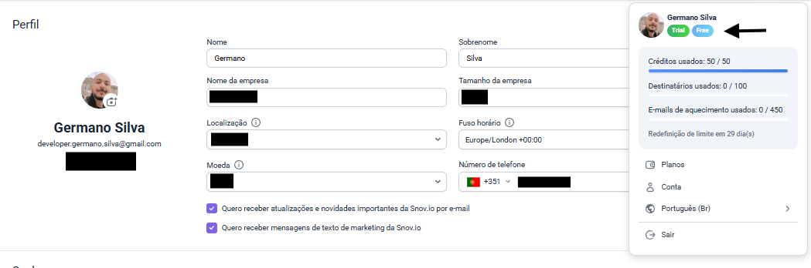
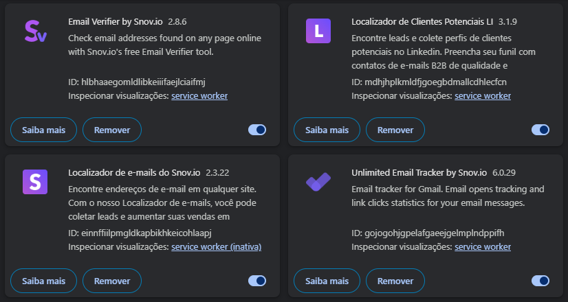
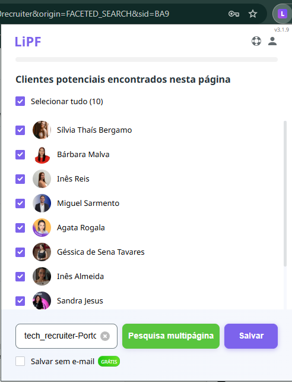
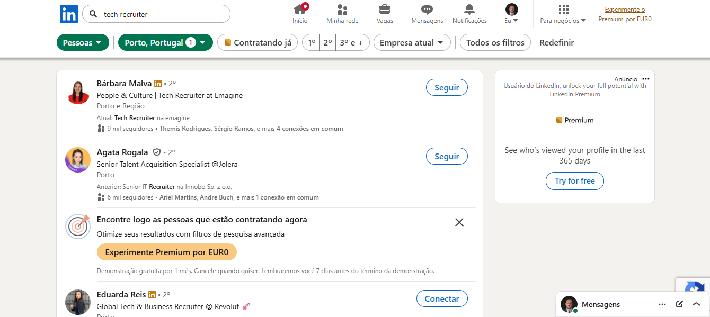
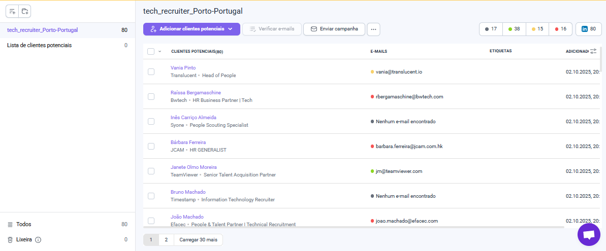

# Exercício Prático de Prospecção com Snov.io

## Índice

1. [Introdução ao Exercício](#introdução-ao-exercício)
2. [PASSO 1: Cadastro na Plataforma Snov.io (Versão Gratuita)](#passo-1-cadastro-na-plataforma-snovio-versão-gratuita)
   - 1.1 [Acesso e Registro](#11-acesso-e-registro)
   - 1.2 [Configuração Inicial](#12-configuração-inicial)
   - 1.3 [Exploração Inicial do Dashboard](#13-exploração-inicial-do-dashboard)
3. [PASSO 2: Instalação das Extensões](#passo-2-instalação-das-extensões)
   - 2.1 [Vídeo Tutorial de Referência](#21-vídeo-tutorial-de-referência)
   - 2.2 [Extensão](#22-extensão)
4. [PASSO 3: Exploração das Bases de Dados - Funcionalidade "Localizador"](#passo-3-exploração-das-bases-de-dados---funcionalidade-localizador)
   - 3.1 [Acesso ao Email Finder (Localizador)](#31-acesso-ao-email-finder-localizador)
   - 3.2 [Métodos de Prospecção](#32-métodos-de-prospecção)
   - 3.3 [Técnicas de Prospecção Eficaz](#33-técnicas-de-prospecção-eficaz)
5. [PASSO 4: Criação de Listas Organizadas](#passo-4-criação-de-listas-organizadas)
   - 4.1 [Estrutura de Organização](#41-estrutura-de-organização)
   - 4.2 [Criar uma Nova Lista](#42-criar-uma-nova-lista)
   - 4.3 [Adicionar Contatos às Listas](#43-adicionar-contatos-às-listas)
   - 4.4 [Gestão e Manutenção](#44-gestão-e-manutenção)
6. [PASSO 5: Documentação e Submissão do Exercício](#passo-5-documentação-e-submissão-do-exercício)
   - 5.1 [Preparação do E-mail](#51-preparação-do-e-mail)
   - 5.2 [Envio do Trabalho](#52-envio-do-trabalho)
7. [Conclusão](#conclusão)

---

## Introdução ao Exercício

Este guia vai ajudá-lo a dominar as funcionalidades essenciais da Snov.io para prospecção e organização de contatos profissionais. O objetivo é demonstrar competências práticas na captação e gestão estruturada de leads.

---

## **PASSO 1: Cadastro na Plataforma Snov.io (Versão Gratuita)**

### 1.1 Acesso e Registro

1. Acesse o site oficial: [**www.snov.io**](https://snov.io/)
2. Clique em **"Sign Up"** ou **"Start Free"**
3. Escolha uma das opções de registro:
   - E-mail e senha
   - Conta Google (recomendado para acesso rápido)
   - Conta Microsoft

### 1.2 Configuração Inicial

1. **Confirme o seu e-mail** através do link enviado para a sua caixa de entrada
2. Complete o perfil básico quando solicitado:
   - Nome completo
   - Função/cargo (pode indicar "Estudante" ou "Em formação")
   - Setor de atividade
3. **IMPORTANTE**: Quando apresentado com opções de planos:
   - Selecione **"Continue with Free Plan"** ou **"Skip"**
   - **Não insira dados de cartão de crédito**
   - Mantenha-se no plano gratuito durante todo o exercício

### 1.3 Exploração Inicial do Dashboard

Familiarize-se com o painel principal:
- **Dashboard**: visão geral das suas atividades
- **Prospects**: onde ficam armazenados os contatos
- **Campaigns**: funcionalidade de e-mail marketing (não necessário para este exercício)
- **Tools**: acesso às ferramentas de prospecção

---

## **PASSO 2: Instalação das Extensões**

### 2.1 Vídeo Tutorial de Referência

Antes de começar, consulte o tutorial oficial:
> 🔹 [**Library | Loom - 24 January 2025**](https://www.loom.com/share/f5419ee1add34616baa81757807dcdf9?sid=d2bed657-9133-4979-9fe2-3e3f9f3ccd29)

### 2.2 Extensão

**Extensões do Snov.io**

1. Dentro da plataforma Snov.io, procure por **"Extensions"** ou **"Add-ons"** no menu
2. Clique em **"Extension"** > **"Todas as extensões"**
3. Você será redirecionado para uma página no Snov.io onde terá todas as extensões para instalar
4. Clique em **"Instalar"**
5. Você será redirecionado para a Chrome Web Store
6. Clique em **"Adicionar ao Chrome"** > **"Adicionar extensão"**
7. Aguarde a instalação (aparecerá um ícone da Snov.io na barra de extensões)

**Extensões Disponíveis:**
1. [Localizador de Clientes Potenciais LI](https://chromewebstore.google.com/detail/mdhjhplkmldfjgoegbdmallcdhlecfcn?utm_source=item-share-cb)
2. [Unlimited Email Tracker by Snov.io](https://chromewebstore.google.com/detail/gojogohjgpelafgaeejgelmplndppifh?utm_source=item-share-cb)
3. [Email Verifier by Snov.io](https://chromewebstore.google.com/detail/hlbhaaegomldlibkeiiifaejlciaifmj?utm_source=item-share-cb)
4. [Localizador de e-mails do Snov.io](https://chromewebstore.google.com/detail/einnffiilpmgldkapbikhkeicohlaapj?utm_source=item-share-cb)

---

## **PASSO 3: Exploração das Bases de Dados - Funcionalidade "Localizador"**

### 3.1 Acesso ao Email Finder (Localizador)

1. No dashboard da Snov.io, vá a **"Tools"** no menu lateral
2. Selecione **"Email Finder"** ou **"Domain Search"**
3. Esta é a ferramenta principal para explorar bases de dados

Ferramenta indisponível para o LinkedIn conforme imagem abaixo:

### 3.2 Métodos de Prospecção

**Processo de Localização de Tech Recruiters no Porto via LinkedIn**

1. **Acesso ao Sales Navigator**
   - Acesse o LinkedIn Sales Navigator (https://www.linkedin.com/sales)
   - Faça login com suas credenciais

---

2. **Configuração da Pesquisa**

**Filtros de Localização:**
- Clique em "Pesquisa de Leads" (Lead Search)
- Em **Geografia**, selecione:
  - País: Portugal
  - Cidade: Porto (ou Porto, Porto District)

**Filtros de Cargo/Função:**
- Em **Cargo atual** (Current Job Title), insira termos como:
  - "Tech Recruiter"
  - "Technical Recruiter"
  - "IT Recruiter"
  - "Talent Acquisition" (com foco em tech)
  - "Recruitment Consultant" (tech)

**Filtros Adicionais Recomendados:**
- **Função** (Function): Human Resources, Recruiting
- **Setor** (Industry): 
  - Staffing and Recruiting
  - Information Technology
  - Software Development
- **Palavras-chave**: "tech recruitment", "IT recruitment", "developer recruitment"

---

3. **Refinamento dos Resultados**
   - Revise os perfis que aparecem
   - Verifique se correspondem ao perfil desejado
   - Ajuste os filtros conforme necessário

---

4. **Salvamento na Lista**

**Criar a Lista:**
- No canto superior direito, clique em "Salvar pesquisa"
- Ou vá para a seção "Listas" no menu lateral

**Salvar Leads Individualmente:**
- Para cada perfil relevante, clique no botão "Salvar"
- Selecione ou crie a lista **"tech_recruiter-Porto-Portugal"**

**Salvamento em Massa:**
- Selecione múltiplos perfis usando as caixas de seleção
- Clique em "Salvar na lista" no topo
- Escolha/crie a lista **"tech_recruiter-Porto-Portugal"**

---

5. **Organização e Gestão**
   - Acesse "Listas" no menu do Sales Navigator
   - Localize sua lista **"tech_recruiter-Porto-Portugal"**
   - Adicione tags ou notas para segmentação adicional
   - Configure alertas para novos leads que correspondam aos critérios

---

### 3.3 Técnicas de Prospecção Eficaz

**Para demonstrar domínio no exercício:**
1. **Escolha um nicho específico**: ex: "Tech Recruiter em empresas tecnológicas no Porto, Portugal"
2. **Use filtros combinados** para segmentar melhor
3. **Verifique a qualidade dos e-mails**: Dos 80 contatos extraídos do LinkedIn, 17 (21,25%) não possuem e-mail, 38 (47,50%) possuem e-mails válidos, 15 (18,75%) apresentam e-mails de classificação incerta (empresariais, pessoais ou falsos) e 16 (20,00%) possuem e-mails inválidos.

---

## **PASSO 4: Criação de Listas Organizadas**

### 4.1 Estrutura de Organização

**Princípios de uma boa lista:**
- **Nome descritivo**: ex: "RH_Tecnologia_Lisboa_2025"
- **Critérios claros**: cada lista deve ter um propósito específico
- **Segmentação**: não misture perfis muito diferentes

### 4.2 Criar uma Nova Lista

1. No menu lateral, clique em **"Prospects"**
2. Clique em **"+ Create List"** ou **"New List"**
3. Defina:
   - **Nome da lista**: descritivo e profissional
   - **Descrição** (opcional): critérios usados para seleção
   - **Tags** (opcional): palavras-chave para filtros futuros

### 4.3 Adicionar Contatos às Listas

**Método 1 - A partir do Email Finder:**
1. Após uma pesquisa no Domain Search
2. Selecione os contatos relevantes (checkbox)
3. Clique em **"Add to list"** ou **"Save to prospects"**
4. Escolha a lista de destino ou crie uma nova

**Método 2 - Via Extensão LinkedIn:**
1. Enquanto navega nos resultados de pesquisa do LinkedIn
2. Use a extensão para selecionar múltiplos perfis
3. Clique em **"Add to Snov.io"** e escolha a lista

**Método 3 - Importação Manual:**
1. Se tiver dados em Excel/CSV
2. Vá a **"Prospects"** > **"Import"**
3. Faça upload do arquivo e mapeie as colunas

**Para cada lista, garanta:**
- Mínimo de 10-20 contatos
- Campos preenchidos: nome, cargo, empresa, e-mail, LinkedIn
- Notas adicionadas quando relevante (ex: "Contato prioritário", "Empresa em crescimento")

### 4.4 Gestão e Manutenção

1. **Adicione tags personalizadas**: clique em cada contato e adicione tags relevantes
2. **Use o campo "Notes"**: registre informações importantes sobre cada lead
3. **Verifique os e-mails**: use a funcionalidade de verificação para confirmar validade
4. **Exporte para backup**: baixe as listas em CSV regularmente

---

## **PASSO 5: Documentação e Submissão do Exercício**

### 5.1 Preparação do E-mail

**✓ Cadastro Completo:**
- Print do dashboard inicial da Snov.io mostrando o seu nome/perfil
- Indicação clara de que está no plano gratuito
- Imagem com as informações do perfil:

**✓ Extensões Instaladas:**
- Print da barra de extensões do Chrome mostrando os ícones da Snov.io

**✓ Exploração de Bases de Dados:**
- Print de pesquisas realizadas no Localizador de Clientes Potenciais LI:

- Capturas mostrando diferentes filtros aplicados:

- Exemplo de resultados obtidos com e-mails encontrados:

### 5.2 Envio do Trabalho

**Enviar para:** dadoseti@preparaportugal.com

**Checklist Final:**
- [x] Prints bem organizados e legíveis
- [x] E-mail profissional com assunto claro
- [x] Resumo do trabalho realizado incluído no corpo do e-mail
- [x] Todos os 4 passos documentados
- [x] Arquivos com nomenclatura organizada

---

## **Conclusão**

Este exercício evidencia competências essenciais no uso de **ferramentas de prospecção digital**, na **organização estruturada de dados** e na **gestão qualificada de leads profissionais**. Além de reforçar a importância da **qualidade da informação coletada**, demonstra também a aplicação de um **pensamento estratégico** no tratamento e validação de contatos.

Concluir todas as etapas com rigor e clareza representa não apenas o domínio técnico das ferramentas utilizadas, mas também a capacidade de transformar dados brutos em insights relevantes para a **captação e gestão eficiente de oportunidades de negócio**.