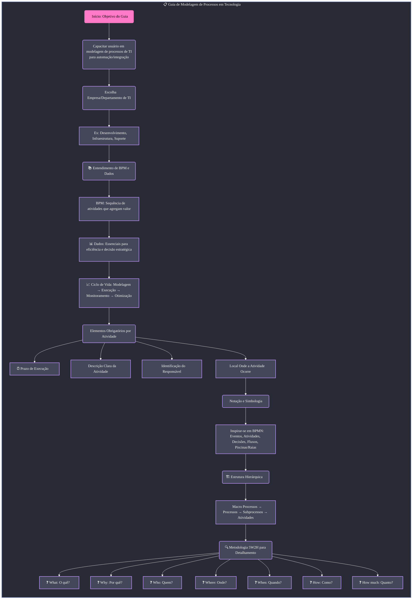
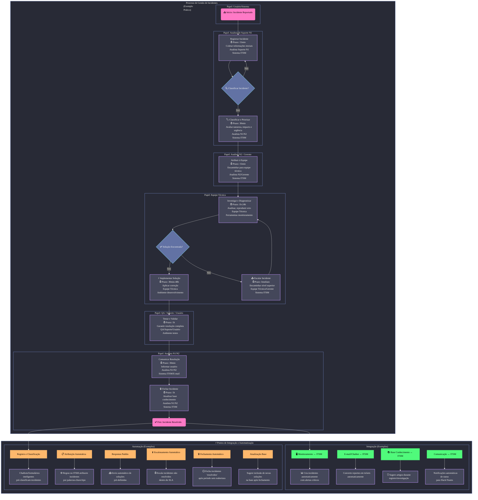

# Exercício 01 - Modelagem de Processos em Tecnologia

## Módulo 4 - Otimização da Gestão de Tempo e Recursos

---

## Objetivo do Exercício

Desenvolver uma modelagem completa de processos de um departamento de tecnologia utilizando plataformas visuais (Miro/Whimsical), aplicando os conceitos de **Business Process Management (BPM)** e preparando o terreno para futuras integrações e automatizações.

---

## Contexto Escolhido

**Empresa:** Departamento de Tecnologia (Fictício)  
**Departamento:** Suporte Técnico e Operações de TI  
**Processo Selecionado:** **Gestão de Incidentes**

### Por que Gestão de Incidentes?

O processo de Gestão de Incidentes é crítico para:
- Manutenção da disponibilidade e performance de sistemas
- Garantia da continuidade dos negócios
- Satisfação dos usuários finais
- Identificação de melhorias e oportunidades de automação

---

## Estrutura da Modelagem

### Elementos Obrigatórios Documentados

Para cada atividade do processo, foram obrigatoriamente documentados:

| Elemento | Descrição |
|----------|-----------|
| ⏰ **Prazo de Execução** | Tempo estimado ou máximo para conclusão da atividade |
| 📄 **Descrição Clara** | Explicação objetiva do que a atividade envolve e seus objetivos |
| 👤 **Responsável** | Papel ou pessoa encarregada de executar a atividade |
| 🏢 **Local de Execução** | Sistema, ferramenta, e-mail ou ambiente onde a atividade é realizada |

### Metodologia 5W2H Aplicada

Cada atividade foi detalhada considerando:

- **What?** (O quê?) - Atividade específica a ser realizada
- **Why?** (Por quê?) - Propósito e objetivo da atividade
- **Who?** (Quem?) - Responsável pela execução
- **Where?** (Onde?) - Local/sistema onde ocorre
- **When?** (Quando?) - Prazo de execução
- **How?** (Como?) - Método de execução
- **How much?** (Quanto?) - Recursos envolvidos

---

## 🔄 Fluxo do Processo de Gestão de Incidentes

### Visão Macro do Processo

```
Incidente Reportado → Registro → Classificação → Atribuição → 
Investigação → Solução → Validação → Comunicação → Fechamento
```

### Papéis Envolvidos

- 👤 **Analista de Suporte N1** - Registro, classificação inicial e comunicação
- 👤 **Analista de Suporte N2 / Gerente** - Classificação avançada e atribuição
- 👥 **Equipe Técnica** - Investigação, diagnóstico e implementação de soluções
- 🧪 **QA / Usuário Final** - Teste e validação da solução

---

## Arquivos do Projeto

### Diagramas Mermaid

#### 1. Guia de Modelagem de Processos
**Arquivo:** [`Guia_de_Modelagem_de_Processos.mmd`](/Guia_de_Modelagem_de_Processos.mmd)

Este diagrama apresenta a estrutura conceitual do guia de modelagem, incluindo:
- Escolha de empresa e departamento
- Entendimento de BPM e dados
- Elementos obrigatórios por atividade
- Notação e simbologia (BPMN)
- Estrutura hierárquica de processos
- Metodologia 5W2H completa

**Visualização:**


#### 2. Processo de Gestão de Incidentes (Exemplo Prático)
**Arquivo:** [`Modulo_4_Aula_9_Exercicio_1.mmd`](/Modulo_4_Aula_9_Exercicio_1.mmd)

Este diagrama apresenta o fluxo completo e detalhado do processo de Gestão de Incidentes, incluindo:
- Todas as etapas do processo com swimlanes (raias por papel)
- Elementos obrigatórios de cada atividade
- Pontos de decisão e fluxos alternativos
- **Pontos de Integração identificados**
- **Oportunidades de Automação mapeadas**

**Visualização:**


---

## Ferramentas e Tecnologias Mencionadas

### Sistemas ITSM
- Jira Service Management
- ServiceNow

### Monitoramento
- Grafana
- Prometheus
- Zabbix
- Datadog
- ELK Stack (Elasticsearch, Logstash, Kibana)

### Desenvolvimento e CI/CD
- GitHub / GitLab
- Jenkins
- GitLab CI

### Comunicação
- Slack
- Microsoft Teams
- E-mail

---

## KPIs e Métricas do Processo

### Indicadores de Performance

| KPI | Objetivo | Medição |
|-----|----------|---------|
| ⏱️ **Tempo Médio de Resolução (MTTR)** | < 4 horas para incidentes críticos | Tempo entre abertura e fechamento |
| 📈 **Taxa de Resolução no Primeiro Contato** | > 60% | Incidentes resolvidos sem escalonamento |
| ⭐ **CSAT (Satisfação do Cliente)** | > 4.5/5.0 | Pesquisa pós-resolução |
| 🎯 **Cumprimento de SLA** | > 95% | Incidentes resolvidos dentro do prazo |
| 🔄 **Taxa de Reincidência** | < 10% | Incidentes reabertos após fechamento |
| 📊 **Volume de Incidentes por Categoria** | Análise mensal | Identificação de problemas sistêmicos |

---

## Modelagem Visual no Miro

### Link de Acesso
**[Acessar Modelagem Completa no Miro](https://miro.com/welcomeonboard/VVIxTmwvclU4UVQ1NC8zMmFnRWdQdEpWdkRiYk5jd2pxanBlOWJ1SzZyYUtDVXlwREs5RDlablpYOGFCZDN4Zi9wdmZ4cFljdlFvb3hncmw4aytVOUxpaDZPZlJSc1pMdS9maGNQRzd2VDZpOERiUWpPSmJEWDQvaUV1aG9ZZ0R0R2lncW1vRmFBVnlLcVJzTmdFdlNRPT0hdjE=?share_link_id=528125263395)**

### Recursos Visuais Incluídos

- ✅ Fluxograma completo com notação BPMN
- ✅ Swimlanes (raias) organizando responsabilidades
- ✅ Cartões detalhados para cada atividade
- ✅ Códigos de cores para diferentes tipos de ação
- ✅ Anotações sobre pontos de integração
- ✅ Identificação visual de oportunidades de automação

---

## Aprendizados e Conclusões

### Principais Insights

1. **Importância da Padronização:** Processos bem documentados facilitam a identificação de melhorias
2. **Dados como Base:** Métricas claras permitem gestão baseada em evidências
3. **Automação Estratégica:** Identificar pontos de automação pode reduzir tempo de resolução em até 60%
4. **Integração de Sistemas:** Ferramentas conectadas eliminam trabalho manual e erros

---

## Referências

- Guia Completo para Modelagem de Processos em Tecnologia (Material do Curso)
- BPMN 2.0 Specification
- ITIL v4 Framework (Incident Management)
- Metodologia 5W2H aplicada a processos
